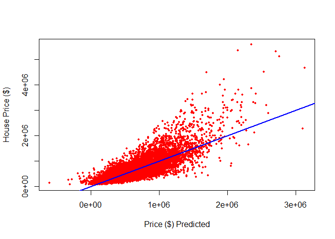

<!-- README.md is generated from README.Rmd. Please edit that file -->

# GEO712PACKAGE

The GEO712PACKAGE is a test R package created for the GEO712 course at
McMaster University. In this R package we share the processed data of a
multiple regression model. We use data from Kaggle, named “House Sales
in King County, USA”, to predict house price using a regression model.
The data set contains house sales prices for King County, which includes
Seattle. It includes homes sold between May 2014 and May 2015, with
21,613 registers and 21 variables regarding the houses sold.

## Installation

You can install the development version of GEO712PACKAGE from
[GitHub](https://github.com/) with:

``` r
# install.packages("devtools")
devtools::install_github("dias-bruno/GEO712PACKAGE")
```

## Example

This is a basic example which shows you how to access the data files.
First, we’ll need call the library “GEO712PACKAGE:

``` r
library(GEO712PACKAGE)
```

Accessing the data:

``` r
data(df)
houses <- df
```

Visualizing the summary of the data:

``` r
summary(houses)
#>      price            bedrooms        bathrooms      sqft_living   
#>  Min.   :  75000   Min.   : 0.000   Min.   :0.000   Min.   :  290  
#>  1st Qu.: 321500   1st Qu.: 3.000   1st Qu.:1.750   1st Qu.: 1425  
#>  Median : 450000   Median : 3.000   Median :2.250   Median : 1910  
#>  Mean   : 539157   Mean   : 3.369   Mean   :2.114   Mean   : 2079  
#>  3rd Qu.: 645000   3rd Qu.: 4.000   3rd Qu.:2.500   3rd Qu.: 2550  
#>  Max.   :5570000   Max.   :11.000   Max.   :8.000   Max.   :13540  
#>     sqft_lot           floors        waterfront            view       
#>  Min.   :    520   Min.   :1.000   Min.   :0.000000   Min.   :0.0000  
#>  1st Qu.:   5040   1st Qu.:1.000   1st Qu.:0.000000   1st Qu.:0.0000  
#>  Median :   7617   Median :1.500   Median :0.000000   Median :0.0000  
#>  Mean   :  15105   Mean   :1.494   Mean   :0.007497   Mean   :0.2339  
#>  3rd Qu.:  10685   3rd Qu.:2.000   3rd Qu.:0.000000   3rd Qu.:0.0000  
#>  Max.   :1651359   Max.   :3.500   Max.   :1.000000   Max.   :4.0000  
#>    condition         grade          sqft_above   sqft_basement   
#>  Min.   :1.000   Min.   : 1.000   Min.   : 290   Min.   :   0.0  
#>  1st Qu.:3.000   1st Qu.: 7.000   1st Qu.:1190   1st Qu.:   0.0  
#>  Median :3.000   Median : 7.000   Median :1560   Median :   0.0  
#>  Mean   :3.409   Mean   : 7.656   Mean   :1788   Mean   : 291.2  
#>  3rd Qu.:4.000   3rd Qu.: 8.000   3rd Qu.:2210   3rd Qu.: 560.0  
#>  Max.   :5.000   Max.   :13.000   Max.   :9410   Max.   :4820.0  
#>     yr_built    predicted_values 
#>  Min.   :1900   Min.   :-609969  
#>  1st Qu.:1951   1st Qu.: 342064  
#>  Median :1975   Median : 479850  
#>  Mean   :1971   Mean   : 539157  
#>  3rd Qu.:1997   3rd Qu.: 669496  
#>  Max.   :2015   Max.   :3126792
```

Now, we already have access to the data and we can create some graphs
about the data:

``` r
plot(houses$price, houses$yr_built, xlab = "Price of the house", ylab = "Year of build")
```


